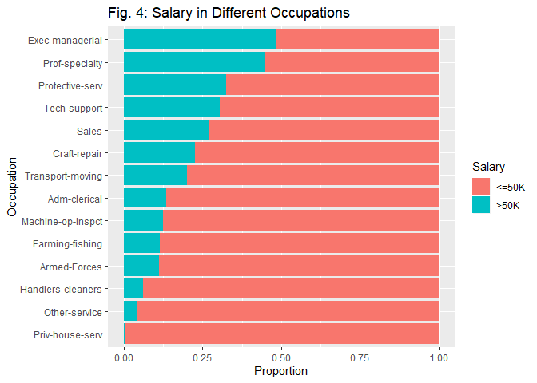

Asian American Income in the United States
================
Brian Yi

Introduction
============

**Purpose:** My goal is to practice and develop my data cleaning, transforming, and exploratory data analysis skills in R. We want to identify overall trends and patterns within our dataset to see what is responsible for the higher median income for Asian Americans in the US. Under the assumption that the factors responsible for the higher income isn't related to race, this knowledge can be useful for anyone who wants to improve their chances of earning a higher income. From an industry view, if a company measures an individual's potential according to their predicted income, they can even use the patterns we discover as metrics to hiring the right employees!

Due to my own Asian ethnic background, I am interested in the factors most responsible for Asian Americans supposedly having a higher median income in the US. I choose the Adult dataset that was extracted from the 1994 US Census Bureau database. This dataset contains various social, economic, educational, and ethnic variables that can be used to predict someone's salary.

**Method of Approach:** Throughout this report, we focus on the following predictors for `salary`: `education_level`, `working_class`, `occupation`, `marital_status`, and `hours_per_week`. We look at each predictor individually, and our analysis of each variable follows a general two step procedure. First, we see if there is a correlation between the predictor and `salary` of the entire US population. *(For example: If our predictor is `education_level`, we determine if there is a correlation between higher education and higher income for the population as a whole.)* Next, we determine if Asians occupy the respective fields of the predictor that correlate to higher salary. *(Following the same example: If higher education corresponds to higher income, we determine whether Asians have a higher average eductation. If Asians indeed have a higher eductation than average, since higher education correlates with higher income, then we know that `education_level` is a variable responsible for the higher median income among Asians.)*

**Results:** We discover that `education_level` and `work_hours` are the only predictors of the five with a definitive correlation with `price`. The other predictors will require a slightly more statistical analysis, which does not fall under the focus of our project, if we want to know whether they are responsible for the higher median income for Asians.

Data Tidying
------------

After importing the dataset, I noticed that the dataset did not import the varialbe names so I decided to re-import it with its default titles presented in the Adult dataset. I then filtered out the following variables that I felt were redundant or negligible when predicting salary.

-   `relationship` is a redundant variable given the similar information that `marital_status` already provides.
-   `capital_gain` and `capital_loss` are both variables that are negligible when in comparison to a person's overall salary.
-   `education_years` numerical values do not actually correlate to the number of years of education someone received. The variable is a numerical indicator for the `education_level` heirarchy that orders the education levels.

I then checked for missing values and was surprised to see that there were none in the dataset. However, I did notice that there were a few categorical variables with "?" as a value and decided to take a closer look. The categorical values that have "?" as a value are `working_class`, `occupation`, and `native country`. I calculated the percentage of "?" observations in each category and decided to keep all three variables since the number of "?" did not exceed 5%. I treated "?" as a missing value by replacing them with `NA` and plan to evaluate them later on in a case by case basis.

While looking at the `education_level` variable, I noticed that I could group all of the non-highschool graduates together into one variable and group the two associate degrees together since I don't think it will be important to see the difference between the individual grades or associate degrees. I also renamed some of the other variables to be more person friendly.

``` r
#Importing dataset with proper category names
adult <- read_csv("adult.data", col_names = c("age", "working_class", "fnlwgt", "education_level", "education_years", "marital_status", "occupation", "relationship", "race", "sex", "capital_gain", "capital_loss", "hours_per_week", "native_country", "salary"))

#Removing redundant variables
adult <- select(adult, -c(relationship, capital_gain, capital_loss, education_years))

#Checking for missing values
 sum(is.na(adult$native_country))

#Calculating number of "?"
 adult %>%
   group_by(working_class) %>%
   count(sort = T)

 adult %>%
   group_by(occupation) %>%
   count(sort = T)

 adult %>%
   group_by(native_country) %>%
   count(sort = T)

#Replace "?" with NA
adult <- adult %>% 
  mutate(working_class = ifelse(working_class == "?", NA, working_class),
         occupation = ifelse(occupation == "?", NA, occupation),
         native_country= ifelse(native_country == "?", NA, native_country))

#Grouping non-highschool graduates and associate degreees together
tmp <-  c("Preschool|1st-4th|5th-6th|7th-8th|9th|10th|11th|12th" = "Non-HS-grad",
          "Assoc-acdm|Assoc-voc" = "Associates", "Prof-school" = "Professional")
adult$education_level <- str_replace_all(adult$education_level, tmp)
```

Asian Economic Status in the US
===============================

I first determined that Asians make up approximately 3.2% of this dataset, which is reasonably representative of the percentage of Asians in the entire US population. Since I will be comparing the median salary between Asians and the rest of the US for the remaining of this section, I will adjust the race variable to just be either Asian or non-Asian to make analysis easier.

``` r
#Adjusting race variable for ease in access in this section focused on the Asian demographic
adult$race <- str_replace_all(adult$race, c("White|Black|Amer-Indian-Eskimo|Other" = "Non-Asian",
                                            "Asian-Pac-Islander" = "Asian"))
#Asian representation in the dataset
adult %>% 
  group_by(race) %>% 
  count() %>% 
  spread(race, n) %>% 
  mutate(total = Asian + `Non-Asian`,
         Asian = Asian / total,
         `Non-Asian` = `Non-Asian` / total)
```

    ## # A tibble: 1 x 3
    ##    Asian `Non-Asian` total
    ##    <dbl>       <dbl> <int>
    ## 1 0.0319       0.968 32561

Myth or not?
------------

**Do Asians have a higher salary compared to the rest of the country?**

A preliminary point to note is that `salary` is categorical and divided between greater than 50K or less than 50K annual salary. A quick examination shows that the Asian population does indeed have a higher salary comparatively to the rest of the US. Our goal is to determine which factors account for this 2.5% increase in salary within the Asian population.

**Assumption**: The proportion of people who make over 50K in any distinct variable is reflected in a similar fashion within both Asian and non-Asian populations. *(For example: If 50% of Professors make more than 50K in the US as a whole, 50% of Asian professors and 50% of non-Asian professors also make more than 50K.)*

``` r
# Calculation of salary in Asian population comparatively to rest of US
adult %>%
  group_by(salary, race) %>% 
  count() %>% 
  spread(salary, n) %>% 
  mutate(total = `<=50K` + `>50K`,
         `>50K` = `>50K` / total,
         `<=50K` = `<=50K`/ total)
```

    ## # A tibble: 2 x 4
    ## # Groups:   race [2]
    ##   race      `<=50K` `>50K` total
    ##   <chr>       <dbl>  <dbl> <int>
    ## 1 Asian       0.734  0.266  1039
    ## 2 Non-Asian   0.760  0.240 31522

Higher Education
----------------

**Does higher education correlate to more salary?**

*Fig. 1 displays the proportion of people that makes more than 50K at each level of education.*

``` r
# Fig. 1 displays the proportion of people that makes more than 50K at each level of education
adult %>% 
  ggplot() +
  geom_bar(aes(x = reorder(education_level, salary == ">50K"), fill = salary), position = "fill") +
  labs(title = "Fig. 1: Salary Across Education Levels",
       x = "Education Level",
       y = "Proportion",
       fill = "Salary")
```


It is clear that higher levels of education correlate to higher salary. Only 10% of students who do not finish high school end up making more than 50K, and less than 20% of highschool graduates make more than 50K. On the opposite side of the spectrum, 60% of Masters graduates earn more than 50K, and 75% of PHD's and Professional School graduates make more than 50K.

**Do Asians have a higher level of education comparatively to the rest of the US?**

*Fig. 2 shows how Asians and non-Asians are distributed among the various levels of education for comparison. Keep in mind that the combination of all the blue bars make up the total non-Asian population, and that the same property applies to the red bars that make up the Asian population.*

``` r
# Fig. 2 shows how each Asians and non-Asians are distributed among the various levels of education for comparison
education_order <- c("Non-HS-grad", "HS-grad", "Some-college", "Associates",
                     "Bachelors", "Masters", "Professional", "Doctorate")

adult %>% 
  mutate(education_level = factor(education_level,levels = education_order)) %>% 
  group_by(race) %>% 
  ggplot() +
  geom_bar(aes(education_level, ..prop.., group = race, fill = race), position = "dodge") +
  labs(title = "Fig. 2: Education Distribution Within Asian and Non-Asian Populations",
       x = "Education Level",
       y = "Proportion",
       fill = "Race")
```


If we designate the cut-off between higher and lower levels of education to be the point between an Associate's and a Bachelor's degree, Fig. 2 displays this division clearly. To the left of this cut-off, non-Asians occupy the lower levels of education at higher proportions comparatively to Asians. While to the right of this cut-off, the proportion of Asians that receive a Bachelor's, Master's, Professional, or PHD degree is at least 1.5 to 2 times greater than that of non-Asians. From this data, we can infer that education seems like a priority for Asian households for us to see such a proportion of their population earning a Bachelor's degree or higher. Thus, education level seems like a big factor that is responsible for the higher salary among Asians in the US.

Working Class
-------------

**Do Asians occupy the working classes that have higher salary?**

*Fig. 3 shows the proportion of Asians and non-Asians in various working classes. It may seem like there are many things going on at first, so first focus on the working classes (along the y-axis) that each consist of a horizontal bar divided between olive green and red. The olive green bar indicates the proportion of people within that working class that earns more than 50K while the red bar indicates the remaining proportion that earns less than 50K. Fig. 3 is ordered such that the working classes with the lowest salary (least amount of green bar) is at the top, and the highest salary (greatest amount of green bar) is at the bottom. Note that you cannot see the olive green bar in the Private working class since it is blocked.*

``` r
# Fig. 3 shows the proportion of Asians and non-Asians in various working classes
adult %>%
  filter(working_class != "Without-pay", working_class != "Never-worked") %>% 
  ggplot() +
  geom_bar(aes(reorder(working_class, salary == "<=50K"), ..prop.., group = salary,
               fill = salary), position = "fill", alpha = 2.5/5) +
  geom_bar(aes(reorder(working_class, salary == "<=50K"), ..prop.., group = race,
               fill = race), position = "dodge") +
  coord_flip() +
  labs(title = "Fig. 3: Prop. of Asians and Non-Asians in Diff. Working Classes",
       x = "Working Class",
       y = "Proportion",
       fill = NULL)
```


Among the working classes, the private sector earns the least salary and the incorporated self employment has the highest salary. The blue and purple bars indicate the proportion of Asians and non-Asians respectively in each working class. At first glance, Asians seem to beat out non-Asians in the top two highest earning working classes - federal government and incorporated self employment.

Keep in mind that the blue bars in each working class aggregate to the total Asian population, and the same property applies to the purple bars that make up the entire non-Asian population. Looking at the private sector, an overwhelming 75% of both Asians and non-Asians occupy this least salary working class. Even though we initially noticed that Asians occupy more of the highest two salary working classes, it is imperative to notice that less than 10% of the total Asian population occupy these two working classes. In other words, even though Asians do occupy the higher salary working classes comparatively to the rest of the US, the vast majority of both Asians and non-Asians being in the private sector makes this difference much less influential. In summary, we don't know for sure if working class plays a factor in the salary for Asians being higher.

Occupation
----------

**Which occupations have a higher salary?**

*Fig. 4 shows the proportion of people that make more than 50K in each occupation. It is organized such that the highest salary occupations are listed at the top and the least are at the bottom. Since the NA values only make up 5% of the total dataset and also have a very low proportion making over &gt;50K, we remove these observations.*

``` r
# Fig. 4 shows the proportion of people that make more than 50K in each occupation
adult %>% 
  filter(!is.na(occupation)) %>% 
  ggplot() +
  geom_bar(aes(reorder(occupation, salary == ">50K"), fill = salary), position = "fill") +
  coord_flip() +
  labs(title = "Fig. 4: Salary in Different Occupations",
       x = "Occupation",
       y = "Proportion",
       fill = "Salary")
```



Fig. 4 shows that Executive and managerial positions have the highest salary while handlers and cleaners make the least amount of salary in the US. Let's investigate whether Asians reside in the occupations that have higher salaries.

**Do Asians occupy the occupations that have higher salary?**

*Fig. 5 shows how each Asians and non-Asians are distributed among the various levels of education for comparison. Keep in mind that the combination of all the blue and red bars make up the total non-Asian and Asian populations respectively. Fig. 5 is organized such that the occupations with higher salary are at the top with the least salary occupations at the bottom.*

``` r
# Fig. 5 shows how each Asians and non-Asians are distributed among the various levels of education for comparison
adult %>% 
  filter(!is.na(occupation)) %>% 
  ggplot() +
  geom_bar(aes(reorder(occupation, salary == ">50K"), ..prop.., group = race, fill = race), position = "dodge") +
  coord_flip() +
  labs(title = "Fig. 5: Prop. of Asians and Non-Asians in Diff. Occupations",
       x = "Occupation",
       y = "Proportion",
       fill = "Race")
```


We are happy to see that the majority of both our populations are not stuck in occupations with the least salary (as was the case in Fig. 3). Let's first focus on the occupations that have at least 10% of a population within that occupation: Executive/Mangerial, Professors, Sales, Craft Repairs, Clerical, and Other Service. Executive/Managerial and Sales have similar proportions when comparing Asians and non-Asians so we keep looking elsewhere. From Fig. 4, we see that only 10% of Clerical and Other Service workers make more than 50K, so their impact is negligible. The remaining two professions are listed below:

-   *Profession (Ranking, Percentage making 50K+)*
-   Professors (2, 45%): There are 5% more Asians than non-Asians as professors.
-   Craft Repair (6, 25%): There are 5% more non-Asians than Asians in Craft repairs.

Since for every craft repairer making over 50K, there are two professors making over 50K, there are more Asians in higher paying occupations. However, this overall difference is once again quite small so we can't conclude whether occupation plays a role in Asians having a higher salary.

Marital Status
--------------

**Do Asians have the marital statuses that have higher salary?**

*Fig. 6 is similar in setup to Fig. 3 from above. Fig. 6 shows the proportion of Asians and non-Asians with each marital status and the respective salary of that marital status. Each marital status is split between an olive green bar and a light red bar. The olive green bar represents the proportion of that particular marital status earning more than 50K. For example, the marital status with the highest salary is `Married-civ-spouse` with almost 75% making over 50K. Fig. 6 is ordered such that the highest salary marital status is at the bottom and the least salary is at the top.*

``` r
# Fig. 6 shows the proportion of Asians and non-Asians with each marital status and the respective salary of that marital status
adult %>%
  filter(marital_status != "Married-AF-spouse") %>% 
  ggplot() +
  geom_bar(aes(reorder(marital_status, salary == "<=50K"), ..prop.., group = salary,
               fill = salary), position = "fill", alpha = 2.5/5) +
  geom_bar(aes(reorder(marital_status, salary == "<=50K"), ..prop.., group = race,
               fill = race), position = "dodge") +
  coord_flip() +
  labs(title = "Fig. 6: Prop. of Asians and Non-Asians with Diff. Marital Statuses",
       x = "Marital Status",
       y = "Proportion",
       fill = NULL)
```


The purple and blue bars each represent a proportion of non-Asian and Asian populations respectively, and both aggregate to the total population. We can see that the population is mainly distributed between the highest salary marital status, `Married-civ-spouse`, and the least salary marital status, `Never-married`. In both of these marital statuses, there are about 3% more Asians than non-Asians. Keep in mind that about 75% of people who are `Married-civ-spouse`, make more than 50K so this difference has some influence. Since there still is only a 3% difference between Asians and non-Asians in that marital status, we can conclude that marital status only plays a small factor in Asians having a higher salary.

Work Hours
----------

**Does number of work hours per week correlate to salary?**

*Fig. 7 is an area chart that shows the distribution of people who make more than 50K (blue) or less than 50K (red) at varying number of work hours per week. In other words, each shaded area in total represents the total number of people who make that particular salary.*

``` r
# Fig. 7 is an area chart that shows the distribution of people who make more than 50K (blue) or less than 50K (red) at varying number of work hours per week
ggplot() +
  geom_area(data = filter(adult, salary == "<=50K"),
            aes(hours_per_week, ..density.., fill = "<=50K"),
            stat = "bin", binwidth = 2.5, alpha = 2/5) +
  geom_area(data = filter(adult, salary == ">50K"),
            aes(hours_per_week, ..density.., fill = ">50K"),
            stat = "bin", binwidth = 2.5, alpha = 2/5) +
  labs(title = "Fig. 7: Salary at Different Work Hours",
       x = "Work Hours",
       y = "Proportion",
       fill = "Salary") +
  coord_cartesian(xlim = c(10, 70))
```


For Americans who make less than 50K, there is a pretty normal distribution in that most of the people work 40 hours a week with an even distribution on both sides. On the other hand, there is a heavy right skew for Americans who make more than 50K. This indicates that working 40 hours or more is a good indicator of a higher salary in the United States. Note that there are peaks between 40 and 60 hours at 5 hour intervals. If hours per week is impactful in Asians having a higher salary, then we would see Asians working more comparatively to non-Asians at the peaks we see in Fig. 7. We will explore specifically the range between 40 and 60 hours to see if this occurs.

**Do Asians work more hours per week?**

*Fig. 8 shows the distribution of Asians and non-Asiangs among different work hours for comparison. Fig. 8 will focus only work hours greater than 40 since we are focusing on the work hours that correlate to higher salary. The semi-transparent bars for Asian and non-Asian are overlayed upon each other such that the Asian bar is underneath. For example, there are more non-Asians comparatively working 45 hours since the blue bar is taller; there are more Asians working 60 hours, since the red bar is taller.*

``` r
# Fig. 8 shows the distribution of Asians and non-Asiangs among different work hours for comparison
ggplot() +
  geom_bar(data = adult,
           aes(hours_per_week, ..prop.., group = race, color = race, fill = race), position = "identity", alpha = 2/5) +
  labs(title = "Fig. 8: Prop. of Asians and Non-Asians Working Diff. Work Hours",
       x = "Work Hours",
       y = "Proportion") +
  coord_cartesian(xlim = c(40, 60),
                  ylim = c(0,.55))
```


``` r
# Proportion of Asians working 40-60 hours compared to non-Asians
adult %>% 
  mutate(bank = (hours_per_week >= 40 & hours_per_week <= 60)) %>% 
  group_by(race, bank) %>% 
  count() %>%
  spread(bank, n) %>% 
  transmute(total = `FALSE` + `TRUE`,
            `40-60 work_hours` = `TRUE` / total,
            `remaining` = `FALSE` / total)
```

    ## # A tibble: 2 x 4
    ## # Groups:   race [2]
    ##   race      total `40-60 work_hours` remaining
    ##   <chr>     <int>              <dbl>     <dbl>
    ## 1 Asian      1039              0.740     0.260
    ## 2 Non-Asian 31522              0.727     0.273

At the peaks we mentioned in Fig. 7, we see in Fig. 8 that there are more non-Asians working between 45 and 60 hours per week. However, at 40 hours, Asians do eclipse non-Asians by a much larger proportion. To properly analyze whether Asians popularize more of the 40 to 60 hour range over all, we calculated the exact proportion of Asians and non-Asians that work in this spectrum. Turns out, there are 1.5% more Asians in the 40 to 60 work hour range due to the huge difference at 40 work hours between the two populations. However, this difference is still small overall so hours per week only plays a small factor in the wage difference between Asians and the rest of the US.

Confounding Factors
-------------------

There is a huge wage gap between genders so we decide to check if there is disproportionate number of males in either the Asian or non-Asian populations. Turns out, they both have pretty similar proportions of males to females so there are no worries here.

``` r
# Wage gap between males and females
adult %>% 
  group_by(sex, salary) %>% 
  count() %>% 
  spread(salary, n) %>% 
  mutate(total = `<=50K` + `>50K`,
         `<=50K` = `<=50K` / total,
         `>50K` = `>50K` / total)
```

    ## # A tibble: 2 x 4
    ## # Groups:   sex [2]
    ##   sex    `<=50K` `>50K` total
    ##   <chr>    <dbl>  <dbl> <int>
    ## 1 Female   0.891  0.109 10771
    ## 2 Male     0.694  0.306 21790

``` r
# Proportion of males to females in both Asian and non-Asian populations
adult %>% 
  group_by(race, sex) %>% 
  count() %>% 
  spread(sex, n) %>% 
  mutate(total = Female + Male,
         Female = Female / total,
         Male = Male / total)
```

    ## # A tibble: 2 x 4
    ## # Groups:   race [2]
    ##   race      Female  Male total
    ##   <chr>      <dbl> <dbl> <int>
    ## 1 Asian      0.333 0.667  1039
    ## 2 Non-Asian  0.331 0.669 31522

Conclusion
==========

After looking at the five variables (`education_level`, `working_class`, `occupation`, `marital_status`, and `hours_per_week`), we conclude that `education_level` and `hours_per_week` seem to have the heaviest influence in the higher median salary in the Asian population. We cannot determine whether `occupation`, `marital_status`, and `working_class` have a correlation with `price` without a more statistically rigorous approach. *(For example: In `hours_per_week`, we were slightly more rigorous in mathematically calculating the exact proportion of Asians that occupied the 40 to 60 hours per week range.)* We first inspected whether a predictor correlates to higher salary for certain values of that variable. Assuming that our discovered proportions from the entire US population is exactly reflected in the Asian and non-Asian demographics, we then investigated whether Asians occupied the values of the variable that correlate to higher salaries.

If we were to move onto some modelling, one thing to note is that we would have to pay attention to multicollinearity. We initially saw that Asians tend to get higher levels of education including a doctorate degree, and this was seen once again in our occupation analysis where there was proportionally a much larger number of Asians that were professors. This correlation between `education_level` and `occupation` could be explored in further exploratory data analysis. Overall, I had a lot of fun improving my data cleaning skills and EDA by becoming more familiar with the `tidyverse` package!
